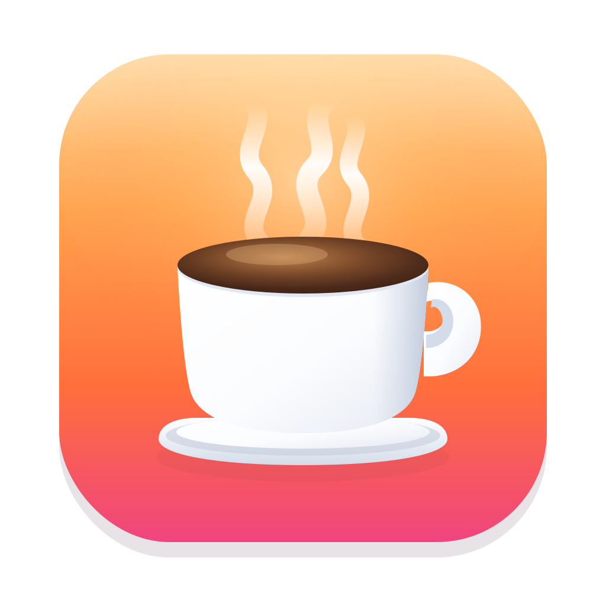

<div align="center">



# CaffeineTimer

**A tiny macOS menu-bar app that keeps your Mac awake for a set duration.**

Like the `caffeinate` command-line tool — but with a coffee-cup in your menu bar, pick-a-duration menu, a live countdown, and a notification when time's up.


</div>

---

## Overview

CaffeineTimer lives entirely in your menu bar (no Dock icon, no window). Click the
coffee-cup icon, choose how long you want your Mac to stay awake, and it prevents the
display and system from going to sleep for exactly that long — then quietly releases the
hold and lets your Mac sleep normally again.

It uses the **same underlying mechanism as Apple's built-in `caffeinate` tool** (an IOKit
power assertion), so there's no background daemon, no helper process, and no third-party
dependencies — just one small native app.

## Features

- ☕️ **Menu-bar only** — outline cup when idle; tinted red cup with a compact countdown
  when a timer is running.
- ⏱ **Preset durations** — **15 / 30 / 60 / 120 minutes** and **Indefinite**.
- 🔁 **Single active timer** — picking a new duration *replaces* the running one
  (releases the old keep-awake, starts the new, resets the countdown). No stacking.
- 👀 **Live time remaining** — open the menu while a timer runs to see exactly how much
  time is left.
- ✋ **Stop early** — a **Stop** item ends the keep-awake before it expires.
- 🔔 **Notifications** — a confirmation when you start a timer and another when it expires
  naturally (with a graceful fallback if notifications are denied).
- 🪶 **Featherweight & native** — AppKit + IOKit + UserNotifications only. No subprocess,
  no dependencies, no telemetry.

## How to use

1. Click the **coffee-cup icon** in the menu bar.
2. Choose a duration — **15 / 30 / 60 / 120 min** or **Indefinite**.
3. The cup turns red and shows a countdown; a notification confirms the timer started.
4. To check the time left, just open the menu again.
5. To end it early, open the menu and choose **Stop**. (Choosing a different duration also
   replaces the current timer.)
6. When the timer expires on its own, the keep-awake is released and you get a
   notification.

> **Notifications off?** If you've denied notification permission, the menu shows a
> **"Turn On Notifications…"** shortcut that jumps to the right pane in System Settings.
> The red menu-bar cup is always the primary visual confirmation regardless.

## Installation

### Build from source (works today)

> Requires the Xcode **Command Line Tools** (no full Xcode needed) and Apple Silicon.

```sh
git clone git@github.com:marcvig/caffeinate-mac-timer.git
cd caffeinate-mac-timer
./build.sh                      # builds, bundles, signs → dist/CaffeineTimer.app
open dist/CaffeineTimer.app     # launch it
```

`build.sh` also installs the app to `/Applications` (or `~/Applications` if that isn't
writable; override with `INSTALL_DIR=...`).

### Download the DMG

A signed, notarized drag-to-Applications disk image is produced by `./make_dmg.sh`
(→ `dist/CaffeineTimer.dmg`). When a tagged release is published, the DMG will be attached
to it on the [Releases page](https://github.com/marcvig/caffeinate-mac-timer/releases).

### Homebrew

Once the repository is public and a release is published, it will be installable from a
personal tap:

```sh
brew install --cask marcvig/tap/caffeine-timer
```

## How it works (architecture)

| Concern | Implementation |
|---|---|
| **Keep-awake** | IOKit power assertion (`IOPMAssertionCreateWithName` with `kIOPMAssertionTypePreventUserIdleDisplaySleep`) — the same approach as the `caffeinate` CLI. The assertion is released on stop, expiry, replacement, and app quit. No subprocess. |
| **UI** | AppKit `NSStatusItem` + `NSMenu`, configured as an `LSUIElement` / `.accessory` agent app (no Dock icon). |
| **Countdown** | A repeating `Timer` on the common run-loop mode updates the status-item title; `NSMenuDelegate.menuWillOpen` refreshes the menu text right before it's shown. |
| **Notifications** | `UserNotifications` (`UNUserNotificationCenter`) with on-demand authorization and a system-beep fallback when denied. |

State is modeled as a small state machine — `idle`, `timed(end, minutes)`, or
`indefinite` — which guarantees only one keep-awake is ever active at a time.

## Project layout

```
.
├── Package.swift                 # SwiftPM executable target (AppKit + UserNotifications + IOKit)
├── Sources/CaffeineTimer/
│   ├── main.swift                # app bootstrap (.accessory activation policy)
│   ├── AppDelegate.swift         # lifecycle wiring
│   ├── MenuBarController.swift   # status item, menu, timer state machine, countdown
│   ├── CaffeineController.swift  # IOKit power-assertion wrapper (start/stop)
│   └── NotificationManager.swift # UNUserNotificationCenter wrapper + fallbacks
├── build.sh                      # build + bundle + codesign + install
├── make_dmg.sh                   # build a polished drag-to-Applications DMG
├── make_icns.sh                  # render app icon (.icns) + menu glyph (.pdf) from SVG
└── icon/                         # AppIcon.svg, MenuIcon.svg, and generated assets
```

## Building & development

> **Environment:** macOS, Swift 6 (developed on 6.3), Apple Silicon, Command Line Tools
> only — no `.xcodeproj`. The build path is SwiftPM plus a hand-assembled `.app` bundle.

```sh
./build.sh                 # build + bundle + sign → dist/CaffeineTimer.app, install
./build.sh --notarize      # also zip, submit to Apple's notary service, and staple
./make_dmg.sh              # build the signed/notarized DMG (run after --notarize)
./make_icns.sh            # regenerate icons after editing icon/*.svg
```

Verify the keep-awake is actually holding while a timer runs:

```sh
pmset -g assertions        # look for PreventUserIdleDisplaySleep owned by CaffeineTimer
```

Code signing uses a Developer ID identity if one is present in the keychain (override with
`CODESIGN_IDENTITY=...`), otherwise it falls back to ad-hoc signing.

## Requirements

- **To run:** macOS 13 (Ventura) or later. Apple Silicon. *(Developed and tested on
  current macOS.)*
- **To build:** Xcode Command Line Tools with a Swift 6 toolchain.

## Notes & gotchas

- **Notifications need a real signed `.app`.** Running the bare binary traps
  `UNUserNotificationCenter.current()`, and notification authorization only persists
  reliably when the app is signed with a stable identity.
- **Focus modes suppress banners.** A "Do Not Disturb" / "Reduce Interruptions" Focus will
  silently hold back the banner (the notification still lands in Notification Center).
- **Indefinite mode** keeps your Mac awake until you explicitly Stop it or quit the app.

## License

Personal project — no license is currently specified, so all rights are reserved by the
author. (A license may be added if the project is opened up for reuse.)

---

<div align="center">
Made with ☕️ for staying awake, by Marc Vigod.
</div>
